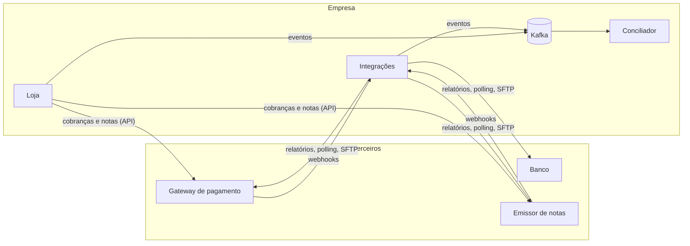

# Reconciliation Lab

Simulação de um ecossistema financeiro para estudar **conciliação**. Uma empresa fictícia vende produtos avulsos e assinaturas e se integra a três serviços terceiros também fictícios: um gateway de pagamento, um banco e um emissor de notas fiscais. Todos são construídos do zero, mas o objetivo central não é construí-los. É **conciliar tudo o que eles produzem** e detectar, classificar e acompanhar cada divergência.

O projeto é propositalmente *over-engineered*. Quatro linguagens, Kafka, AWS emulada, caos injetável e relógio simulado fazem parte do estudo.

> **Status:** em construção. A estrutura do monorepo está pronta e o gateway de pagamento é o primeiro serviço em desenvolvimento.

## Arquitetura

O sistema é dividido em três planos isolados por redes Docker:

- **Empresa:** a loja, a camada de integrações e o conciliador, com Kafka, Postgres, Redis e S3 internos.
- **Terceiros:** gateway, banco e emissor de notas. São caixas pretas que só expõem API, webhook e arquivo.
- **Controle da simulação:** o relógio simulado e o orquestrador de cenários de caos.



## Princípios

- **Terceiros só se comunicam por interfaces públicas.** Nunca publicam no Kafka da empresa, nunca acessam seus bancos e nunca compartilham código com ela.
- **Todo dado externo é guardado cru e imutável** antes de ser processado, o que permite reprocessar qualquer período do zero.
- **O conciliador nunca trapaceia.** Ele só conhece o que uma empresa real conheceria: sem trace IDs e sem acesso aos bancos dos terceiros.
- **A simulação é determinística.** Relógio simulado e caos com seed tornam qualquer cenário reproduzível.

## Serviços

| Serviço | Plano | Stack | Status |
| --- | --- | --- | --- |
| Gateway de pagamento | Terceiro | Node, Fastify, Drizzle, BullMQ | Em desenvolvimento |
| Loja | Empresa | Laravel, PostgreSQL | Planejado |
| Integrações | Empresa | Node, Fastify, Drizzle, BullMQ | Planejado |
| Conciliador | Empresa | Node, Fastify, Drizzle, BullMQ | Planejado |
| Banco | Terceiro | Go, net/http, pgx, sqlc | Planejado |
| Emissor de notas | Terceiro | Python, FastAPI, SQLAlchemy | Planejado |

## Requisitos

- Node 22 (versão fixada em [`.nvmrc`](.nvmrc))
- GNU Make 3.81 ou superior
- Docker com Compose, quando a infraestrutura entrar

Go, PHP e Python passam a ser necessários nas fases em que seus serviços entram.

## Como usar

O `Makefile` da raiz é o ponto de entrada de todas as tarefas. Todo serviço implementa o mesmo conjunto de alvos, seja qual for a linguagem ([ADR 0002](docs/adr/0002-makefile-como-ponto-de-entrada.md)).

```bash
make help                 # lista os comandos
make install              # instala dependências de todos os serviços
make lint                 # roda o lint em todos os serviços
make test s=gateway       # roda os testes de um serviço
make dev s=gateway        # sobe um serviço em modo watch
```

## Estrutura

```text
reconciliation-lab/
├── docs/adr/                    # registros de decisões de arquitetura
├── scripts/                     # utilitários do repositório
├── services/
│   └── third-parties/
│       └── gateway/             # gateway de pagamento (Node + Fastify)
├── Makefile                     # ponto de entrada único
└── project.md                   # documento completo do projeto
```

Pastas são criadas conforme se tornam necessárias. A estrutura completa planejada está na seção 10 do [`project.md`](project.md).

## Roteiro

Cada fase só começa quando a anterior concilia de ponta a ponta.

- [ ] **0. Infra:** docker-compose com Floci, Postgres, Redis, Kafka, SFTP e observabilidade
- [ ] **1. Fatia vertical:** pedido avulso, caminho feliz do gateway, webhook e match pedido ↔ cobrança
- [ ] **2. Dinheiro:** relatório de liquidação, banco com SFTP e match cobrança ↔ liquidação ↔ extrato
- [ ] **3. Fiscal:** emissor de notas e match cobrança ↔ nota
- [ ] **4. Assinaturas:** ciclos, renovação, pró-rata e retentativas
- [ ] **5. Estornos:** reembolsos, chargebacks e cancelamento de notas
- [ ] **6. Caos:** catálogo de falhas e cenários declarativos
- [ ] **7. Produto:** dashboard de divergências, aging e reprocessamento

## Documentação

- [`project.md`](project.md): visão completa do projeto, com objetivos, arquitetura, fluxos, regras de conciliação, catálogo de caos e convenções.
- [`docs/adr/`](docs/adr/): decisões de arquitetura registradas.
