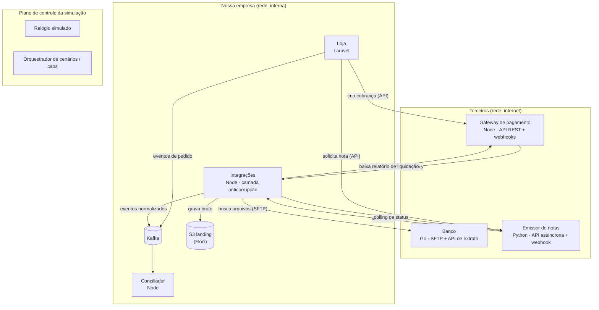

# Reconciliation Lab

Simulação de um ecossistema financeiro realista para estudo de **conciliação**: uma empresa que vende produtos avulsos e assinaturas, integrada a três serviços terceiros fictícios (gateway de pagamento, banco e emissor de notas fiscais). Todos os serviços são construídos do zero, mas o objetivo central não é construí-los: é **conciliar tudo o que eles produzem** e detectar, classificar e acompanhar cada divergência.

O projeto é propositalmente *over-engineered*. A complexidade da infraestrutura faz parte do estudo, assim como o uso de quatro linguagens diferentes.

---

## 1. Objetivos

O objetivo principal é estudar conciliação financeira em condições próximas às reais: fontes independentes, identificadores que não se conversam, atrasos, arquivos em lote, APIs instáveis e falhas silenciosas.

Os objetivos secundários são:

- Praticar integração com terceiros (APIs REST, webhooks, SFTP, relatórios assíncronos) do lado de quem consome.
- Praticar arquitetura orientada a eventos **dentro** da empresa (Kafka, outbox, idempotência, schemas versionados).
- Aprender Go construindo um serviço real e evoluir em Python.
- Exercitar observabilidade distribuída com OpenTelemetry em quatro linguagens.

---

## 2. Princípios do projeto

**Terceiros só se comunicam por interfaces públicas.** O gateway, o banco e o emissor de notas nunca publicam no Kafka da empresa, nunca acessam seus bancos de dados e nunca compartilham código com ela. Eles expõem API, webhook e arquivo, exatamente como um Stripe, um banco ou uma prefeitura fariam. O que acontece dentro deles é detalhe de implementação invisível para a empresa.

**A fronteira é física, não só conceitual.** Redes Docker separadas garantem que um terceiro não consiga alcançar a infraestrutura interna da empresa, mesmo por engano.

**Kafka é infraestrutura interna.** Só os serviços da empresa publicam e consomem eventos.

**Todo dado externo é guardado cru e imutável antes de ser processado.** Isso permite reprocessar qualquer período do zero.

**O conciliador nunca trapaceia.** Ele não usa trace IDs, não lê bancos de terceiros e não recebe "dicas" do plano de controle da simulação. Ele só conhece o que uma empresa real conheceria.

**A simulação é determinística.** Relógio simulado e caos com seed garantem que qualquer cenário possa ser reproduzido.

---

## 3. Arquitetura

O sistema é dividido em três planos.



### 3.1 Plano da empresa

Contém a loja, a camada de integrações e o conciliador, além de toda a infraestrutura interna: Kafka, Postgres, Redis e a "conta AWS" emulada pelo Floci. Somente a loja e a camada de integrações têm acesso à rede dos terceiros.

### 3.2 Plano dos terceiros

Contém o gateway, o banco e o emissor de notas, cada um com seu próprio banco de dados e sua própria infraestrutura interna. Do ponto de vista da empresa, eles são caixas pretas com contratos públicos.

### 3.3 Plano de controle da simulação

Contém o relógio simulado e o orquestrador de cenários de caos. Funciona como "as leis da física" da simulação: todos os serviços o consultam, mas ele nunca é usado para trocar dados de negócio. Fica numa rede própria, com um Redis dedicado.

### 3.4 Redes Docker

| Rede | Participantes |
| --- | --- |
| `internet` | gateway, banco, emissor de notas, loja, integrações |
| `internal` | loja, integrações, conciliador, Kafka, Postgres da empresa, Redis da empresa, Floci, OTel Collector |
| `sim-control` | todos os serviços, Redis do relógio, orquestrador de cenários |
| `third-party-<nome>` | cada terceiro e seu próprio banco de dados |

---

## 4. Serviços

| Serviço | Plano | Stack | Papel na conciliação |
| --- | --- | --- | --- |
| Loja | Empresa | Laravel, PostgreSQL | O que **deveria** acontecer |
| Integrações | Empresa | Node, Fastify, Drizzle, BullMQ | Traduz o mundo externo para eventos internos |
| Conciliador | Empresa | Node, Fastify, Drizzle, BullMQ | Casa registros e classifica divergências |
| Gateway de pagamento | Terceiro | Node, Fastify, Drizzle, BullMQ | O que **foi cobrado** e o que **será repassado** |
| Banco | Terceiro | Go, net/http, pgx, sqlc | O dinheiro que **realmente entrou** |
| Emissor de notas | Terceiro | Python, FastAPI, SQLAlchemy, Pydantic | O que **foi declarado** ao fisco |

A distribuição segue uma regra simples: o domínio mais crítico fica na linguagem de maior domínio (Node) e o domínio mais simples fica na linguagem em aprendizado (Go).

### 4.1 Loja (Laravel)

Responsável por catálogo, pedidos avulsos, planos e assinaturas. Gerencia ciclos de cobrança (mensal e anual), trial, upgrade e downgrade com pró-rata, cancelamento e reembolso.

Chama o gateway para criar cobranças e o emissor para solicitar notas, sempre pelas APIs públicas deles. Recebe a confirmação de pagamento indiretamente, via eventos internos publicados pela camada de integrações. Publica no Kafka seus próprios eventos de domínio usando outbox transacional.

Eventos publicados: `store.order-created`, `store.order-cancelled`, `store.order-refund-requested`, `store.subscription-created`, `store.subscription-renewed`, `store.subscription-changed`, `store.subscription-cancelled`.

### 4.2 Camada de integrações (Node)

É a camada anticorrupção e o único lugar da empresa que conhece os formatos dos terceiros. Responsabilidades:

- Receber webhooks do gateway e do emissor, validar a assinatura HMAC, garantir idempotência, gravar o payload bruto e responder rapidamente.
- Executar jobs agendados (BullMQ): solicitar e baixar relatórios de liquidação do gateway, fazer polling de notas pendentes, buscar arquivos novos no SFTP do banco.
- Gravar todo dado externo cru no bucket de landing do S3 antes de qualquer processamento.
- Traduzir dados externos para eventos internos no vocabulário da empresa e publicá-los no Kafka via outbox.

Eventos publicados: `payments.charge-authorized`, `payments.charge-captured`, `payments.charge-failed`, `payments.charge-refunded`, `payments.chargeback-opened`, `payments.settlement-line-received`, `finance.statement-line-received`, `fiscal.invoice-requested`, `fiscal.invoice-authorized`, `fiscal.invoice-rejected`, `fiscal.invoice-cancelled`.

### 4.3 Conciliador (Node)

Consome apenas eventos internos do Kafka e nunca fala com terceiros. Normaliza registros, executa as regras de matching, gera grupos de conciliação, classifica divergências e calcula métricas. Expõe uma API para consulta de divergências e para disparar reprocessamento de um período. Detalhado na seção 6.

### 4.4 Gateway de pagamento (Node, terceiro)

Simula um gateway no estilo Stripe ou Pagar.me.

Interface pública:

- Autenticação por API key (header `Authorization: Bearer`).
- `POST /v1/charges` com header `Idempotency-Key` obrigatório, suportando cartão (à vista e parcelado), Pix e boleto.
- `POST /v1/charges/{id}/capture`, `POST /v1/charges/{id}/refunds` (total ou parcial).
- `GET /v1/charges` paginado por cursor.
- Webhooks assinados com HMAC-SHA256, com política própria de retentativa e backoff.
- Relatório de liquidação assíncrono: `POST /v1/reports/settlements` cria a solicitação, `GET /v1/reports/{id}` informa o status, e quando pronto devolve a URL do CSV.
- Rate limit com resposta 429 e header `Retry-After`.

Regras de negócio internas: taxa por método de pagamento e por número de parcelas, liquidação de cartão em D+30 por parcela, Pix em D+0 ou D+1, boleto em D+1 após compensação, agrupamento de repasses em lotes diários, desconto de chargebacks e estornos em repasses futuros.

### 4.5 Banco (Go, terceiro)

Simula um banco tradicional, deliberadamente mais "antigo" que os demais.

Interface pública:

- SFTP com um arquivo de extrato por dia útil, em OFX ou num layout posicional inspirado no CNAB 240, publicado após um horário de corte.
- API de extrato opcional, no estilo Open Finance, paginada e com consistência eventual (lançamentos do dia podem não aparecer imediatamente).

O banco recebe os repasses do gateway como créditos agregados por lote, sem nenhuma referência a pedidos. Pode registrar tarifas bancárias próprias como débitos.

### 4.6 Emissor de notas (Python, terceiro)

Simula um provedor de emissão de NFS-e integrado a uma "prefeitura" fictícia.

Interface pública:

- `POST /v1/invoices` responde `202 Accepted` com um número de protocolo.
- `GET /v1/invoices/{protocolo}` informa o status: `processing`, `authorized`, `rejected`, `cancelled`.
- Webhook de mudança de status, propositalmente pouco confiável.
- `POST /v1/invoices/{numero}/cancel`, aceito apenas dentro de um prazo configurável.

Internamente, a "prefeitura" processa as notas de forma assíncrona, pode rejeitar com códigos de erro e pode ficar indisponível por períodos. A referência ao pedido da loja vai em um campo de texto livre, nem sempre preservado.

---

## 5. Fluxos principais

### 5.1 Compra avulsa

A loja cria o pedido e publica `store.order-created`. Em seguida chama o gateway para criar a cobrança, enviando o `order_id` como metadado. O gateway processa e envia webhooks; a camada de integrações os recebe e publica `payments.charge-captured`. Com o pagamento confirmado, a loja solicita a nota ao emissor. Dias depois, a cobrança aparece no relatório de liquidação do gateway e, na data de repasse, como parte de um crédito agregado no extrato do banco.

### 5.2 Assinatura

A loja cria a assinatura e gera uma cobrança por ciclo. Cada renovação dispara uma nova cobrança e uma nova nota. Upgrades e downgrades no meio do ciclo geram cobranças ou créditos proporcionais, cujo cálculo pode divergir entre loja e gateway. Falhas de cobrança disparam retentativas, gerando várias tentativas para um mesmo ciclo.

### 5.3 Estorno e chargeback

Um estorno solicitado pela loja gera um reembolso no gateway, que deve ser refletido como desconto num repasse futuro e como cancelamento (ou nota de estorno) no emissor. Um chargeback chega por webhook, possivelmente meses depois, quando a nota já foi emitida e o dinheiro já foi repassado.

### 5.4 Cadeia completa

```
pedido → cobrança → parcela → linha de liquidação → lote de repasse → crédito no extrato
   └──────────────→ nota fiscal
```

---

## 6. Conciliação

### 6.1 Pares de conciliação

| Par | Cardinalidade típica | O que verifica |
| --- | --- | --- |
| Pedido ↔ cobrança | 1:1, às vezes 1:N (retentativas) | Todo pedido pago tem cobrança capturada e vice-versa |
| Cobrança ↔ liquidação | 1:N (parcelas) | Bruto, taxa e líquido batem com o contratado; parcelas somam o total |
| Liquidação ↔ extrato | N:1 (lote) | Cada crédito no banco corresponde exatamente a um lote de repasse |
| Pedido/cobrança ↔ nota | 1:1 | Todo pagamento confirmado tem nota; todo estorno tem cancelamento |

### 6.2 Estratégias de matching

As chaves de ligação são intencionalmente imperfeitas, como no mundo real:

- A loja envia `order_id` ao gateway como metadado, mas alguns eventos do gateway trazem apenas o `charge_id`.
- O relatório de liquidação traz `charge_id` e `batch_id`.
- O extrato do banco traz apenas valor, data e uma descrição que às vezes contém o `batch_id`.
- A nota traz o `order_id` em texto livre, nem sempre presente.

Por isso o conciliador implementa três níveis de regra, aplicados em ordem:

1. **Match por chave exata**, quando os identificadores estão presentes.
2. **Match por chave derivada**, extraindo identificadores de campos de texto ou atravessando a cadeia (nota → pedido → cobrança).
3. **Match heurístico**, por valor e data com tolerância configurável, sempre marcado com nível de confiança menor.

Matches N:1 (lote ↔ crédito) exigem verificar se a soma de um conjunto de linhas de liquidação corresponde ao valor de um crédito, considerando taxas e descontos de estornos.

### 6.3 Modelo de dados do conciliador

```sql
-- Registro normalizado, independente da fonte
create table records (
  id              uuid primary key,
  source          text not null,        -- store | gateway | settlement | bank | invoicing
  external_id     text not null,
  kind            text not null,        -- order, charge, settlement_line, statement_line, invoice...
  amount_cents    bigint not null,
  currency        char(3) not null default 'BRL',
  occurred_at     timestamptz not null,
  references      jsonb not null default '{}',  -- chaves conhecidas: order_id, charge_id, batch_id...
  raw_ref         text not null,        -- ponteiro para o bruto no S3
  ingested_at     timestamptz not null,
  unique (source, external_id, kind)
);

-- Grupo de registros casados entre fontes
create table match_groups (
  id              uuid primary key,
  pair            text not null,        -- order_charge, charge_settlement, settlement_bank, charge_invoice
  rule            text not null,        -- exact, derived, heuristic
  confidence      numeric(3,2) not null,
  created_at      timestamptz not null
);

create table match_group_records (
  match_group_id  uuid references match_groups(id),
  record_id       uuid references records(id),
  primary key (match_group_id, record_id)
);

-- Divergências encontradas
create table discrepancies (
  id              uuid primary key,
  category        text not null,
  pair            text not null,
  amount_at_risk_cents bigint not null,
  status          text not null,        -- open, pending_window, auto_resolved, in_review, accepted
  detected_at     timestamptz not null,
  resolved_at     timestamptz,
  details         jsonb not null
);

create table discrepancy_records (
  discrepancy_id  uuid references discrepancies(id),
  record_id       uuid references records(id),
  primary key (discrepancy_id, record_id)
);
```

### 6.4 Categorias de divergência

| Categoria | Exemplo |
| --- | --- |
| `missing_counterpart` | Pedido pago sem cobrança; cobrança sem pedido |
| `amount_mismatch` | Valor cobrado diferente do valor do pedido |
| `fee_mismatch` | Taxa aplicada diferente da contratada |
| `duplicate` | Duas cobranças capturadas para o mesmo pedido |
| `status_mismatch` | Pedido cancelado com cobrança capturada |
| `settlement_missing` | Cobrança capturada que nunca aparece na liquidação |
| `batch_mismatch` | Crédito no banco que não bate com nenhum lote |
| `invoice_missing` | Pagamento confirmado sem nota autorizada |
| `invoice_orphan` | Nota emitida para pedido não pago ou cancelado |
| `refund_not_reflected` | Estorno sem desconto em repasse ou sem cancelamento de nota |
| `rounding` | Diferença de centavos entre a soma das parcelas e o total |

### 6.5 Divergência real versus temporária

Muitas "faltas" são apenas atraso: uma cobrança de cartão capturada hoje só deve aparecer no banco em 30 dias. Toda divergência de ausência tem uma janela esperada; enquanto a janela não vence, o status é `pending_window`. Só depois de vencida ela vira `open`. Divergências que se resolvem sozinhas com a chegada do dado passam a `auto_resolved`.

### 6.6 Métricas

- Taxa de match automático, por par e por regra.
- Valor total em aberto, em reais.
- Aging das divergências (0–7, 8–30, 31–90, mais de 90 dias).
- Tempo médio até a resolução.
- Distribuição de divergências por categoria.

### 6.7 Reprocessamento

A conciliação é idempotente: reprocessar um período a partir do bruto no S3 produz exatamente o mesmo resultado, sem duplicar registros ou divergências. Isso permite corrigir regras do matcher e reexecutar a história inteira.

---

## 7. Caos

Cada serviço lê sua configuração de caos do SSM Parameter Store (Floci), com probabilidades e seed. Alterar um parâmetro muda o comportamento sem redeploy.

### 7.1 Catálogo de falhas

**Gateway:** webhook perdido, duplicado ou fora de ordem; cobrança duplicada; timeout após sucesso (a empresa acha que falhou, mas foi cobrado); taxa diferente da contratada; relatório de liquidação atrasado, incompleto ou republicado com correções; linha de liquidação no lote errado; chargeback tardio; respostas 429 e 5xx.

**Banco:** arquivo atrasado, duplicado ou ausente no SFTP; lote dividido em dois créditos; tarifa bancária inesperada; lançamento estornado e relançado; API de extrato com consistência eventual.

**Emissor de notas:** rejeição pela prefeitura; prefeitura fora do ar; webhook nunca entregue; referência ao pedido perdida; cancelamento recusado por prazo vencido.

**Empresa (falhas internas intencionais):** um serviço sem outbox, perdendo eventos; cálculo de pró-rata divergente do gateway; virada de dia por fuso horário; renovação de assinatura marcada como ativa sem pagamento confirmado.

### 7.2 Cenários declarativos

Cada cenário fica em `scenarios/` e descreve o que injetar e o que o conciliador deve encontrar. Os cenários formam a suíte de testes de ponta a ponta.

```yaml
name: webhooks-duplicados-e-taxa-errada
seed: 42
duration_days: 45
load:
  orders_per_day: 200
  subscription_share: 0.4
chaos:
  gateway:
    webhook_duplicate_rate: 0.05
    fee_mismatch_rate: 0.01
  bank:
    late_file_rate: 0.10
expected:
  discrepancies:
    duplicate: 0          # duplicação de webhook não pode virar cobrança duplicada
    fee_mismatch: { min: 70, max: 110 }
  auto_match_rate: { min: 0.97 }
```

---

## 8. Relógio simulado

Todos os serviços, de todos os planos, obtêm o "agora" de uma biblioteca que lê a chave `sim:now` no Redis do plano de controle, e nunca o relógio do sistema. O orquestrador de cenários pode avançar o tempo (por exemplo, "pular 30 dias"), o que torna possível testar liquidações D+30, renovações mensais, prazos de cancelamento de nota e chargebacks tardios em minutos.

Há uma biblioteca cliente por linguagem em `libs/sim-clock/` (TypeScript, PHP, Python e Go). Todos os horários são armazenados em UTC; conversões para `America/Sao_Paulo` acontecem apenas nas bordas onde o negócio exige (data de competência da nota, data do extrato).

---

## 9. Infraestrutura

### 9.1 Componentes

| Componente | Uso |
| --- | --- |
| PostgreSQL | Um banco por serviço; os terceiros têm instâncias isoladas em suas próprias redes |
| Redis | BullMQ, chaves de idempotência e rate limit da empresa; instância separada para o relógio simulado |
| Kafka | Eventos internos da empresa, com schema registry |
| Floci | Emulação da conta AWS da empresa |
| SFTP (`atmoz/sftp`) | Entrega de arquivos de extrato pelo banco |
| OpenTelemetry Collector | Recebe traces, métricas e logs de todos os serviços |
| Grafana, Tempo, Loki, Prometheus | Visualização de observabilidade |

### 9.2 Uso do Floci

| Serviço AWS | Uso |
| --- | --- |
| S3 | Bucket `landing` para dados brutos de terceiros; bucket `reports` para relatórios do conciliador |
| SQS | Filas entre etapas de ingestão de arquivos |
| Secrets Manager | API keys dos terceiros e segredos de webhook |
| SSM Parameter Store | Configuração de caos e parâmetros de negócio (taxas contratadas, janelas esperadas) |
| CloudWatch Logs | Opcional, como destino alternativo de logs |

### 9.3 Kafka

Tópicos internos, todos com schema registrado em `contracts/`:

| Tópico | Produtor | Consumidores |
| --- | --- | --- |
| `store.orders` | Loja | Conciliador |
| `store.subscriptions` | Loja | Conciliador |
| `payments.charges` | Integrações | Loja, conciliador |
| `payments.settlements` | Integrações | Conciliador |
| `finance.statements` | Integrações | Conciliador |
| `fiscal.invoices` | Integrações | Loja, conciliador |

Toda publicação usa outbox transacional. Consumidores são idempotentes. Opcionalmente, o relay do outbox pode ser feito com Debezium lendo o WAL do Postgres.

### 9.4 Observabilidade

Todos os serviços são instrumentados com OpenTelemetry. O contexto de trace é propagado nos headers HTTP e nos headers das mensagens Kafka, **apenas dentro da empresa**. Os terceiros têm telemetria própria, visível num painel separado ("modo deus") útil para depuração, mas nunca consultado pelo conciliador.

Além das métricas técnicas (latência, erros, lag de consumo), o conciliador exporta as métricas de negócio da seção 6.6, que alimentam o dashboard principal do projeto.

---

## 10. Estrutura do repositório

```
reconciliation-lab/
├── contracts/                  # JSON Schema / Protobuf dos eventos internos
│   └── third-party-apis/       # OpenAPI dos terceiros (documentação pública)
├── services/
│   ├── company/
│   │   ├── store/              # Laravel
│   │   ├── integrations/       # Node + Fastify + Drizzle + BullMQ
│   │   └── reconciler/         # Node + Fastify + Drizzle + BullMQ
│   └── third-parties/
│       ├── gateway/            # Node + Fastify + Drizzle + BullMQ
│       ├── bank/               # Go
│       └── invoicing/          # Python + FastAPI
├── sim-control/
│   ├── clock/                  # serviço do relógio simulado
│   └── orchestrator/           # executor de cenários e caos
├── libs/
│   ├── sim-clock/              # clientes do relógio (ts, php, py, go)
│   └── chaos/                  # leitura da config de caos (ts, php, py, go)
├── infra/
│   ├── docker-compose.yml
│   ├── networks.md             # documentação das redes e da fronteira
│   ├── bootstrap/              # criação de buckets, filas, segredos e parâmetros no Floci
│   ├── otel/
│   └── grafana/                # dashboards provisionados
├── scenarios/                  # cenários de caos e resultados esperados
├── docs/
│   └── adr/                    # registros de decisões de arquitetura
└── Makefile
```

---

## 11. Roteiro

Cada fase só começa quando a anterior concilia de ponta a ponta.

| Fase | Entrega | Critério de conclusão |
| --- | --- | --- |
| 0. Infra | docker-compose com Floci, Postgres, Redis, Kafka, SFTP e observabilidade; redes separadas | Todos os containers sobem; um trace de teste aparece no Grafana |
| 1. Fatia vertical | Loja (pedido avulso), gateway (caminho feliz), integrações (webhook), conciliador (pedido ↔ cobrança) | 100% de match em um dia simulado sem caos |
| 2. Dinheiro | Relatório de liquidação, banco em Go com SFTP, match cobrança ↔ liquidação ↔ extrato | Lotes N:1 conciliados após avançar 30 dias |
| 3. Fiscal | Emissor em Python, polling e webhook, match cobrança ↔ nota | Toda cobrança capturada com nota correspondente |
| 4. Assinaturas | Ciclos, renovação, pró-rata, retentativas | Conciliação correta em 90 dias simulados |
| 5. Estornos | Reembolsos, chargebacks, cancelamento de notas | Estornos refletidos nos três terceiros |
| 6. Caos | Catálogo de falhas e cenários declarativos | Todos os cenários em `scenarios/` passam |
| 7. Produto | Dashboard de divergências, aging e reprocessamento | Reprocessar um período gera resultado idêntico |

---

## 12. Convenções

- Valores monetários sempre em centavos, como inteiros (`bigint`). Nunca ponto flutuante.
- Horários sempre em UTC, obtidos do relógio simulado.
- Identificadores internos em UUID v7; identificadores de cada terceiro em formato próprio (por exemplo `ch_...` no gateway).
- Toda operação de escrita entre serviços tem chave de idempotência.
- Todo dado externo é gravado cru no S3 antes do processamento, com o caminho registrado em `raw_ref`.
- Mudanças de schema de eventos são versionadas e retrocompatíveis.
- Decisões de arquitetura relevantes são registradas como ADR em `docs/adr/`.

---

## 13. Riscos e fora de escopo

O maior risco do projeto é passar semanas em infraestrutura e nunca chegar à conciliação. A regra de ouro é proteger a fatia vertical da fase 1: nenhuma peça nova entra antes de pedido ↔ cobrança conciliar de ponta a ponta.

Fica fora de escopo: regras fiscais reais (cálculo de tributos, layouts oficiais de NFS-e), integração com provedores reais, segurança de nível produtivo (PCI, gestão de chaves) e deploy em nuvem real.

---

## 14. Glossário

| Termo | Significado |
| --- | --- |
| Conciliação | Processo de verificar se registros de fontes diferentes sobre o mesmo fato estão consistentes |
| Liquidação (settlement) | Repasse do dinheiro de uma transação do gateway para a conta da empresa |
| Lote de repasse | Agrupamento de várias liquidações num único crédito bancário |
| D+N | Prazo de N dias após a transação para o repasse |
| Chargeback | Contestação da compra pelo portador do cartão, revertendo o pagamento |
| Pró-rata | Valor proporcional cobrado ou creditado numa mudança de plano no meio do ciclo |
| Outbox | Padrão em que o evento é gravado na mesma transação do dado e publicado depois por um relay |
| Camada anticorrupção | Camada que isola o domínio interno dos formatos e conceitos de sistemas externos |
| Aging | Tempo que uma divergência permanece sem resolução |
| NFS-e | Nota Fiscal de Serviço Eletrônica |
