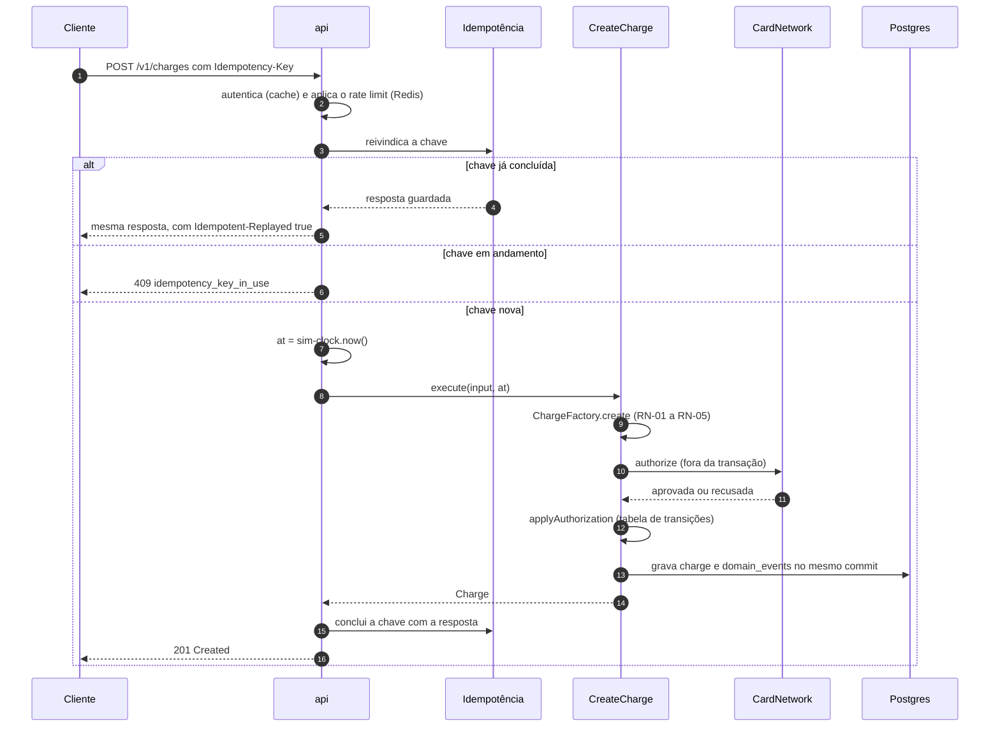
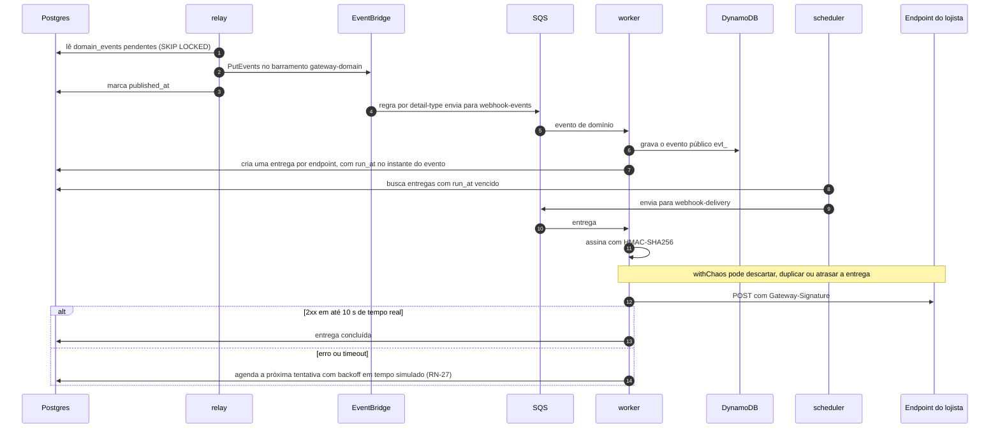
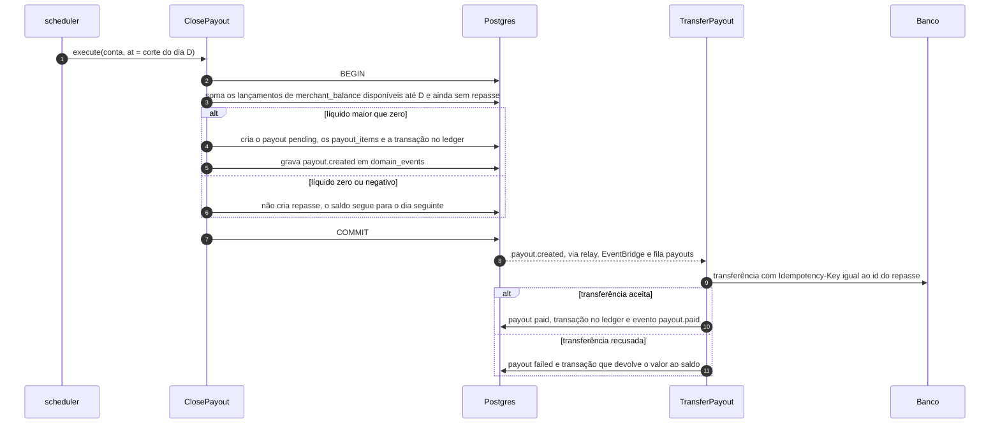

# Gateway de pagamento: arquitetura

- **Status:** Aceita (decisões A1 a A10)
- **Data:** 2026-10-01

Este documento descreve a arquitetura interna do gateway. Ele complementa a [especificação de requisitos](requisitos.md), que define o que o gateway faz. As decisões que atravessam vários serviços estão nas ADRs da raiz, em [`docs/adr/`](../../../../docs/adr/).

## 1. Contexto e premissas de carga

O gateway é desenhado como se precisasse atender milhões de usuários. Estes números são hipóteses de dimensionamento e orientam as decisões deste documento:

| Métrica | Hipótese |
| --- | --- |
| Cobranças | 50 milhões/mês: cerca de 20/s em média e ~500/s no pico (25x a média, como numa Black Friday) |
| Requisições à API | ~5 por cobrança (criar, consultar, listar, relatório): ~2.500 req/s no pico |
| Webhooks | ~3 por cobrança: ~1.500 entregas/s no pico |
| Lançamentos no ledger | ~4 por cobrança: ~200 milhões de linhas/mês |

Quase todo o volume vem de **um único lojista**, a empresa. Isso tem duas consequências:

- **Sem sharding por conta:** uma única conta concentraria toda a carga num só shard.
- **Sem linha de saldo:** nenhuma linha de "saldo da conta" pode ser atualizada a cada cobrança, porque viraria um ponto de contenção.

O sistema é desenhado para escalar, mas roda pequeno: no ambiente local, cada papel de processo tem uma réplica.

## 2. Estilo e papéis de processo

O gateway é um **monólito modular hexagonal** (A1). Os fluxos de dinheiro precisam ser atômicos: cobrança, lançamentos no ledger e eventos gravados no mesmo commit. Microsserviços colocariam rede e transações distribuídas no meio desses fluxos.

A escala vem de rodar **o mesmo código em papéis diferentes**, cada um escalado de forma independente:

| Papel | Responsabilidade | Escala |
| --- | --- | --- |
| `api` | API HTTP pública | Horizontal, sem estado |
| `worker` | Consome as filas SQS: entrega de webhooks, geração de relatórios, transferências de repasse | Horizontal, com concorrência configurada por fila |
| `relay` | Lê o outbox (`domain_events`) e publica no EventBridge | Horizontal, com `FOR UPDATE SKIP LOCKED` |
| `scheduler` | Executa a tabela `scheduled_jobs`, aplica a barreira por instante e publica a marca d'água ([ADR 0007](../../../../docs/adr/0007-agendamento-em-tempo-simulado.md)) | Um ativo por vez, eleito por lock consultivo do Postgres, com uma réplica de reserva |
| `simulator` | O mundo simulado: pagador de Pix e boleto, compensação, abertura de chargebacks | Um. Não existiria num gateway real |

Todos os papéis usam a mesma imagem, com entrypoint `node dist/main.js <papel>`. Cada papel tem graceful shutdown:

- para de aceitar trabalho novo;
- termina o que está em andamento;
- libera os locks.

### Infraestrutura e rede

A infraestrutura vem do Floci do gateway ([ADR 0012](../../../../docs/adr/0012-servicos-aws-por-organizacao.md)), com uma exceção: o Redis do gateway (`gateway-redis`) é um container próprio, sem persistência, usado para rate limit e cache de autenticação ([ADR 0014](../../../../docs/adr/0014-kafka-e-redis-em-containers-proprios.md)).

| Serviço AWS | Uso no gateway |
| --- | --- |
| RDS PostgreSQL 18 | Banco de dados principal, com PgBouncer na frente |
| EventBridge | Barramento `gateway-domain`, que roteia os eventos de domínio para as filas |
| SQS, com DLQ | Filas dos papéis `worker` e `simulator` |
| DynamoDB | Log público de eventos (seção 7.4) |
| S3 | Relatórios de liquidação |
| KMS | Cifragem dos segredos dos endpoints de webhook |
| Secrets Manager | Credenciais do banco de dados e da API interbancária |
| AppConfig | Configuração de caos e do comportamento do pagador ([ADR 0013](../../../../docs/adr/0013-appconfig-para-configuracao-de-caos.md)) |

Tudo isso fica na rede `third-party-gateway` ([ADR 0011](../../../../docs/adr/0011-topologia-de-rede.md)):

- **Entrada:** o papel `api` recebe requisições pelo proxy de borda, como `gateway-api`. Os downloads dos relatórios passam pelo mesmo proxy, como `gateway-s3`.
- **Saída:** só o papel `worker` entra também na rede `internet`, porque é ele que chama os webhooks da empresa e a API interbancária do banco.

## 3. Módulos

| Módulo | Responsabilidade | Agregados | Fase |
| --- | --- | --- | --- |
| `accounts` | Conta do lojista, API keys, tabela de taxas, configuração de repasse | `Account`, `ApiKey`, `FeeSchedule` | 1 |
| `charges` | Criação, autorização, captura, cancelamento e expiração de cobranças | `Charge` | 1 |
| `webhooks` | Endpoints, eventos públicos, entregas e retentativas | `WebhookEndpoint`, `WebhookDelivery` | 1 |
| `ledger` | Livro-razão de dupla entrada | `LedgerTransaction` | 2 |
| `payouts` | Fechamento diário dos repasses e transferência ao banco | `Payout` | 2 |
| `reports` | Relatório de liquidação em CSV no S3 | `SettlementReport` | 2 |
| `refunds` | Estornos | `Refund` | 5 |
| `disputes` | Chargebacks | `Dispute` | 5 |

Fora dos módulos de negócio ficam:

- `shared/`: o kernel (tipos comuns) e a infraestrutura comum (banco de dados, outbox, scheduler, idempotência, autenticação, rate limit, telemetria);
- `simulation/`: os adaptadores do mundo simulado;
- `chaos/`: os decorators de caos.

### Comunicação entre módulos

- **Síncrona:** um módulo só chama outro pela API pública dele, exportada no `index.ts` do módulo (use cases e query services).
- **Assíncrona:** por eventos de domínio, gravados no outbox e publicados pelo `relay`. Os assinantes são idempotentes, porque a publicação é pelo menos uma vez.
- **Transação compartilhada:** uma transação pode gravar em mais de um módulo, desde que pela API pública de cada um e dentro da mesma Unit of Work. Exemplo: a captura grava a cobrança e os lançamentos do ledger no mesmo commit (fase 2).

Um módulo nunca importa o domínio, a infraestrutura ou as tabelas de outro.

## 4. Camadas e regra de dependência

```text
 http / jobs ──▶ application ──▶ domain
      │               ▲
      ▼               │ implementa as portas
  factories ──▶ infra (Drizzle, Redis, SQS, EventBridge, DynamoDB, S3, KMS, AppConfig, cliente do banco)
```

| Camada | Conteúdo | Pode importar |
| --- | --- | --- |
| `domain` | Agregados, value objects (`Money`, `Installments`, `BusinessCalendar`), eventos de domínio, erros | Apenas `shared/kernel` |
| `application` | Use cases, query services e portas (interfaces de repositório, `UnitOfWork`, `CardNetwork`, `BankTransfer`, `ObjectStorage`) | `domain` e `shared/kernel` |
| `infra` | Implementações das portas | `application`, `domain` e bibliotecas de infraestrutura |
| `http`, `jobs` | Rotas Fastify com schemas Zod e consumidores das filas SQS | `application` e `shared/http` |
| `factories` | Composição dos use cases | Todas as camadas do próprio módulo |

Regras verificadas pelo `dependency-cruiser` no `make lint` (A7):

- `domain` e `application` não importam `fastify`, `drizzle-orm`, `ioredis` nem `@aws-sdk/*`;
- um módulo só importa outro pelo `index.ts` dele;
- `domain` e `application` não importam `simulation/` nem `chaos/`;
- nenhum arquivo importa código de fora de `src/`, exceto `libs/sim-clock` e `libs/chaos`.

### O relógio só é lido nas bordas

Apenas as rotas HTTP e o scheduler leem o `sim-clock`. Os use cases recebem o instante como parâmetro, `execute(input, at: Temporal.Instant)`:

- numa requisição HTTP, `at` é o instante simulado no início da requisição;
- num job agendado, `at` é o `run_at` do job (ADR 0007).

O domínio nunca chama `Temporal.Now` nem `Date.now()`.

### Estrutura de pastas

```text
src/
├── main.ts                      # lê o papel e chama o composition root correspondente
├── roles/                       # composition roots: api.ts, worker.ts, relay.ts, scheduler.ts, simulator.ts
├── modules/
│   ├── accounts/
│   ├── charges/
│   │   ├── domain/              # Charge, ChargeStatus, transições, eventos, erros
│   │   ├── application/         # CreateCharge, CaptureCharge, ..., ChargeQueries, portas
│   │   ├── infra/               # DrizzleChargeRepository, ChargeMapper, schema Drizzle
│   │   ├── http/                # rotas e schemas Zod
│   │   ├── jobs/                # ExpireAuthorization
│   │   ├── factories/           # makeCreateCharge(), ...
│   │   └── index.ts             # API pública do módulo
│   └── webhooks/
├── simulation/                  # SimulatedCardNetwork, pagador, compensação, chargebacks
├── chaos/                       # withChaos() e as políticas de cada falha
└── shared/
    ├── kernel/                  # Money, IDs, DomainError, tipos de tempo
    ├── infra/                   # db, cache, sqs, eventbridge, dynamodb, s3, kms, appconfig, outbox, scheduler, idempotência, telemetria
    └── http/                    # plugins: autenticação, rate limit, idempotência, erros, Request-Id
drizzle/                         # migrations
test/                            # utilitários de teste e suítes de contrato
```

## 5. Padrões

### 5.1 Use case

Cada intenção de negócio é uma classe com um único método `execute(input, at)`. O use case não conhece HTTP. A forma da entrada é validada na borda, pelo Zod, e as regras de negócio ficam no domínio.

### 5.2 Repository

Existe um repositório por agregado (A4):

- a interface fica em `application` e a implementação com Drizzle, em `infra`;
- os testes usam uma implementação em memória;
- os repositórios devolvem entidades de domínio, nunca linhas do banco. A conversão fica num mapper.

```ts
export interface ChargeRepository {
  findById(accountId: AccountId, id: ChargeId): Promise<Charge | null>
  findByIdForUpdate(accountId: AccountId, id: ChargeId): Promise<Charge | null>
  save(charge: Charge): Promise<void>
}
```

`findByIdForUpdate` trava a linha (`SELECT ... FOR UPDATE`) e serializa operações concorrentes sobre a mesma cobrança (RNF-10).

### 5.3 Factories

O projeto usa os dois sentidos de factory (A3):

- **Factory de composição:** uma função `make<UseCase>(infra)` monta o use case com suas dependências. É injeção de dependência manual, sem container e sem decorators de reflexão. Cada papel tem um composition root em `roles/` que cria a infraestrutura uma única vez e chama as factories.
- **Factory de domínio:** cria agregados aplicando as regras de criação. A `ChargeFactory` escolhe a variação por método de pagamento e valida as RN-01 a RN-05.

```ts
// modules/charges/application/create-charge.ts
export class CreateCharge {
  constructor(
    private readonly uow: UnitOfWork,
    private readonly cardNetwork: CardNetwork,
    private readonly chargeFactory: ChargeFactory,
  ) {}

  async execute(input: CreateChargeInput, at: Temporal.Instant) {
    const charge = this.chargeFactory.create(input, at)
    const decision = await this.cardNetwork.authorize(charge) // fora da transação
    charge.applyAuthorization(decision, at)

    await this.uow.run(async ({ charges, outbox }) => {
      await charges.save(charge)
      await outbox.append(charge.pullEvents())
    })
    return charge
  }
}

// modules/charges/factories/make-create-charge.ts
export const makeCreateCharge = (infra: Infra) =>
  new CreateCharge(
    new DrizzleUnitOfWork(infra.db),
    withChaos(new SimulatedCardNetwork(), infra.chaos),
    new ChargeFactory(infra.ids),
  )
```

### 5.4 Unit of Work

`uow.run(fn)` abre uma transação e entrega a `fn` os repositórios e o outbox ligados a ela. A transação é confirmada se `fn` termina e desfeita se `fn` lança um erro.

A transação é passada de forma explícita, e não guardada em `AsyncLocalStorage`, para que o código mostre o que é atômico.

**Regra:** nenhum I/O externo acontece dentro de `uow.run`. Chamar a rede de cartão, o banco ou o S3 com uma transação aberta prende conexões e derruba a vazão no pico.

### 5.5 Query service

Leituras não passam por agregados nem por repositórios (CQRS leve). Os query services consultam o banco e devolvem DTOs direto.

- A listagem usa paginação por chave (`ORDER BY created_at DESC, id DESC`), nunca `OFFSET`. O cursor opaco codifica o par `(created_at, id)` do último item.
- Listagens e relatórios usam a réplica de leitura.
- A consulta de uma cobrança por id usa o primário, para que um `GET` logo depois do `POST` não sofra com o atraso da réplica.

### 5.6 Strategy

Cada método de pagamento tem uma estratégia (`CardStrategy`, `PixStrategy`, `BoletoStrategy`) que define:

- como a cobrança é iniciada: autorização síncrona no cartão; QR code ou boleto pendente;
- como a taxa é calculada (RN-10 a RN-12);
- como a agenda de liquidação é gerada (RN-15).

### 5.7 Tabela de transições

Os estados da cobrança (RN-06) são uma tabela por método de pagamento (A5). Um estado que não aparece como origem é final.

```ts
const TRANSITIONS = {
  card: {
    pending: ['authorized', 'paid', 'failed'],
    authorized: ['paid', 'canceled', 'expired'],
  },
  pix: { pending: ['paid', 'canceled', 'expired'] },
  boleto: { pending: ['paid', 'canceled', 'expired'] },
} as const satisfies Record<PaymentMethod, Partial<Record<ChargeStatus, readonly ChargeStatus[]>>>
```

O agregado consulta a tabela antes de cada transição e lança `InvalidChargeTransition` quando ela não é permitida.

### 5.8 Decorator

Comportamentos transversais envolvem as portas e os use cases sem que o domínio saiba deles:

- `withChaos(porta, chaos)` injeta as falhas do catálogo (RF-17) e emite `chaos.injected` (RF-19);
- `withTracing(useCase)` cria um span OpenTelemetry por execução de use case.

### 5.9 Transactional Outbox e eventos

- Os eventos de domínio são gravados em `domain_events` na mesma transação da mudança de estado (RNF-09).
- O `relay` lê os eventos pendentes com `FOR UPDATE SKIP LOCKED`, publica no barramento `gateway-domain` do EventBridge (`PutEvents`, com o tipo do evento em `detail-type`) e marca `published_at`.
- Regras do EventBridge roteiam cada tipo de evento para as filas SQS que o consomem: `webhook-events`, `simulation`, `payouts`. Cada fila tem uma DLQ.
- Um evento pode ser publicado mais de uma vez, então os consumidores deduplicam pelo id.
- O módulo `webhooks` consome os eventos e cria a versão **pública** de cada um, com id `evt_`, no DynamoDB (seção 7.4). Ele também cria uma entrega por endpoint. O formato interno pode evoluir livremente. Só o formato público é contrato.

### 5.10 Bulkhead

As entregas de webhook são isoladas por endpoint:

- **concorrência:** um limite de entregas simultâneas por endpoint;
- **disjuntor:** depois de várias falhas seguidas, as entregas daquele endpoint pausam e as retentativas seguem o backoff.

Um endpoint lento nunca atrasa as entregas dos outros.

### 5.11 Adapter

O mundo externo de um gateway real (bandeiras de cartão, SPI do Pix, compensação de boletos) fica atrás de portas, implementadas por adaptadores em `simulation/`:

- **De saída:** a `CardNetwork` é chamada pelo use case. O `SimulatedCardNetwork` decide pelos tokens de teste.
- **De entrada:** o papel `simulator` chama use cases como `ConfirmPixPayment`, `CompensateBoleto` e `OpenDispute`, como a rede de pagamentos faria. Ele recebe os eventos pela fila SQS `simulation`, decide com base na seção `behavior` da configuração no AppConfig e agenda as ações em `scheduled_jobs`.

### 5.12 Erros

Erros de domínio são exceções tipadas, derivadas de `DomainError`, com `type` e `code` (A6). Um único error handler do Fastify faz o mapeamento para HTTP no formato do RNF-02:

| Erro | HTTP | Exemplo de `code` |
| --- | --- | --- |
| Validação da entrada (Zod) | 400 | `parameter_invalid` |
| Autenticação | 401 | `api_key_invalid` |
| Recurso não encontrado | 404 | `charge_not_found` |
| Estado incompatível | 409 | `charge_not_capturable` |
| Chave de idempotência em andamento | 409 | `idempotency_key_in_use` |
| Regra de negócio violada | 422 | `refund_exceeds_amount`, `idempotency_key_reused` |
| Rate limit | 429 | `rate_limited` |
| Erro inesperado | 500 | `internal_error`, sem detalhes internos na resposta |

## 6. Fluxos principais

### 6.1 Criar cobrança (cartão à vista, fase 1)



A cobrança guarda a própria chave de idempotência, com uma constraint única por conta. Se o processo cair entre o commit da cobrança e a conclusão da chave, a nova tentativa esbarra na constraint e devolve a cobrança existente, em vez de criar outra.

### 6.2 Entregar webhook (fase 1)



### 6.3 Fechar repasse (fase 2)



O job de fechamento tem chave de deduplicação `(conta, dia)` na tabela `scheduled_jobs`, então um repasse nunca é fechado duas vezes para o mesmo dia.

## 7. Modelo de dados

### 7.1 Tabelas por módulo

| Módulo | Tabelas |
| --- | --- |
| `accounts` | `accounts`, `api_keys` (hash, prefixo visível, `revoked_at`), `fee_schedules` (método, faixa de parcelas, taxa em pontos-base, valor fixo, `effective_from`), `payout_settings` (conta bancária, prazo do Pix, horário de corte) |
| `charges` | `charges` (método, status, valores em centavos, parcelas, `metadata`, dados do método de pagamento, motivo de recusa, chave de idempotência, instantes de cada transição) |
| `webhooks` | `webhook_endpoints` (URL, segredo cifrado), `webhook_deliveries` (tentativa, status, código de resposta, `run_at`). Os eventos públicos ficam no DynamoDB (seção 7.4) |
| `ledger` | `ledger_transactions`, `ledger_entries` |
| `payouts` | `payouts` (dia, `batch_id`, valor, status, id da transferência no banco), `payout_items` (lançamento incluído em cada repasse) |
| `reports` | `settlement_reports` (período, status, versão, chave no S3) |
| Plataforma | `domain_events` (outbox), `scheduled_jobs`, `idempotency_keys` (hash da requisição, status, resposta, `expires_at`) |

O segredo de cada endpoint de webhook precisa ser legível para assinar as entregas. Por isso ele é guardado cifrado, e não como hash, com envelope encryption: uma chave de dados gerada pelo KMS cifra o segredo, e o banco de dados guarda o segredo cifrado junto com a chave de dados cifrada pelo KMS.

### 7.2 Ledger de dupla entrada

Todo evento financeiro gera uma `ledger_transaction` com lançamentos que se anulam: a soma dos débitos é igual à dos créditos (A2). Os lançamentos são imutáveis, e correções são feitas com novas transações.

| Conta contábil | Natureza | Significado |
| --- | --- | --- |
| `cash` | Ativo | Conta de liquidação do gateway: o dinheiro que entra das redes e sai para os bancos |
| `merchant_balance` | Passivo | O que o gateway deve ao lojista, com `available_on` em cada lançamento |
| `merchant_payout_pending` | Passivo | Valor de repasses fechados e ainda não transferidos |
| `gateway_revenue` | Receita | Taxas cobradas |

Exemplo: captura de R$ 100,00 à vista, com taxa de 3,49%.

| Conta | Débito | Crédito | `available_on` |
| --- | --- | --- | --- |
| `cash` | 100,00 | | |
| `merchant_balance` | | 96,51 | D+30 |
| `gateway_revenue` | | 3,49 | |

O mesmo ledger gera as outras visões:

- **Agenda de liquidação:** os créditos em `merchant_balance` com `available_on`. Uma cobrança parcelada gera um par de lançamentos por parcela.
- **Repasse:** os lançamentos de `merchant_balance` disponíveis até o dia, ligados ao repasse por `payout_items`. A ligação fica numa tabela separada para que o ledger continue imutável.
- **Relatório de liquidação:** uma linha por transação que afeta `merchant_balance`. O id da transação é o `line_id` estável (RN-18).

Um job de verificação confere periodicamente que toda transação está balanceada.

### 7.3 Particionamento e retenção

| Tabela | Partição | Retenção |
| --- | --- | --- |
| `ledger_entries` | Mensal | Permanente |
| `webhook_deliveries` | Mensal | 30 dias |
| `domain_events` | Diária | 7 dias depois de publicado |
| `charges` | Nenhuma, por enquanto | Permanente |
| `idempotency_keys` | Nenhuma | 24 horas, com limpeza em lote por `expires_at` |
| `scheduled_jobs` | Nenhuma | Jobs concluídos são limpos em lote |

Em tabelas particionadas do Postgres, a chave primária e as constraints únicas **precisam incluir a chave de partição**. Por isso as tabelas que dependem de unicidade global ficam sem partição:

- `idempotency_keys`: precisa de unicidade por conta e chave;
- `charges`: precisa de unicidade da chave de idempotência.

Quando `charges` precisar de partição, ela será mensal, com chave `(created_at, id)`. Como o id é ordenável por tempo (RN-29), o repositório consegue calcular a partição a partir do id.

### 7.4 Log público de eventos no DynamoDB

Os eventos públicos são escritos uma vez e lidos por conta, em ordem de tempo. Eles não participam da transação da cobrança, porque são criados de forma assíncrona a partir dos eventos de domínio. Isso faz deles um bom caso para o DynamoDB (A10).

Tabela `gateway-events`:

| Atributo | Papel |
| --- | --- |
| `account_id` | Chave de partição |
| `event_id` | Chave de ordenação. O `evt_` é ordenável por tempo (RN-29) |
| `type`, `created`, `data` | O evento público, no formato do contrato |
| `expires_at` | TTL em epoch de tempo real, 30 dias depois da gravação |

Padrões de acesso:

- `GET /v1/events`: `Query` por `account_id`, em ordem decrescente de `event_id`, com o cursor como `ExclusiveStartKey`;
- `GET /v1/events/{id}`: `GetItem` por `account_id` e `event_id`;
- filtro por tipo: um índice secundário global com chave `account_id#type`, se for necessário.

A gravação usa escrita condicional (`attribute_not_exists(event_id)`). Assim, um evento de domínio entregue duas vezes não gera dois eventos públicos.

A retenção de 30 dias é técnica e por isso fica no TTL do DynamoDB, em tempo real (ADR 0012).

## 8. Escala

- **API sem estado:** escala na horizontal. O plugin `@fastify/under-pressure` responde 503 quando o event loop ou o pool de conexões satura, em vez de degradar todas as requisições.
- **Réplica de leitura:** listagens e relatórios leem da read replica do RDS, e as escritas e a consulta por id vão ao primário (seção 5.5). O código mantém os dois pools. No laboratório, a URL da réplica aponta para o primário até que se comprove que a read replica do Floci acompanha o primário (ADR 0012).
- **PgBouncer em modo transação:** fica na frente do RDS e reduz o número de conexões. O RDS Proxy do Floci não faz pooling, por isso não o substitui. No modo transação não há estado de sessão, então o lock consultivo de eleição do `scheduler` usa uma conexão direta ao RDS, sem passar pelo PgBouncer.
- **Idempotência no Postgres:** a chave guardada na cobrança garante que nunca haja duplicidade. A tabela `idempotency_keys` guarda a resposta para replay.
- **Rate limit no Redis do gateway:** token bucket com script Lua atômico, em tempo real (RNF-05). Como o `gateway-redis` não tem persistência, os contadores recomeçam a cada restart, o que é aceitável.
- **Filas SQS por finalidade:** `webhook-events`, `webhook-delivery`, `reports`, `payouts` e `simulation`, cada uma com DLQ e concorrência própria de consumo. As regras do EventBridge fazem o fan-out dos eventos de domínio. As mensagens que esgotam as tentativas vão para a DLQ e geram alerta.
- **Sem pontos de contenção:** nenhuma linha de saldo é atualizada por cobrança. O saldo é calculado por agregação no fechamento do repasse, com índice em `(account_id, available_on)`. Se o volume diário tornar essa agregação lenta, um job pode materializar o saldo por dia numa tabela própria.
- **Relatórios em streaming:** o worker lê da réplica com cursor, gera o CSV aos poucos e envia ao S3 em upload multipart. O arquivo nunca fica inteiro em memória.
- **Cache de autenticação:** a busca da API key fica num LRU em memória, com TTL de 30 segundos em tempo real. Uma chave revogada pode continuar válida por até 30 segundos.
- **Conexões dos webhooks:** um pool `undici` com keep-alive por endpoint, e timeout de 10 segundos em tempo real.

## 9. Testes

| Nível | Ferramenta | O que cobre |
| --- | --- | --- |
| Domínio | Vitest e fast-check | Transições, taxas, parcelas e calendário de dias úteis. Propriedades: as parcelas somam o total; o líquido é o bruto menos a taxa; toda transação do ledger é balanceada |
| Use cases | Vitest, com repositórios em memória e portas falsas | Comportamento, erros e eventos emitidos |
| Repositórios | Vitest, com Postgres 18 real | Mapeamento, locks, constraints e partições |
| Adaptadores AWS | Vitest, com um Floci efêmero | Publicação no EventBridge e roteamento para o SQS, consumo e DLQ, escrita condicional no DynamoDB, upload e URL pré-assinada no S3, cifragem com KMS e leitura do AppConfig |
| HTTP | Vitest, com `app.inject()` | Validação, mapeamento de erros, autenticação, idempotência e rate limit |
| Contrato | Vitest | Respostas validadas contra o OpenAPI exportado e checagem de diferença do YAML (ADR 0009) |
| Determinismo | Vitest | A mesma seed e a mesma configuração produzem as mesmas decisões e os mesmos ids |
| Ponta a ponta | `scenarios/` do monorepo | O gateway junto com os outros serviços |

Os repositórios em memória e os do Drizzle passam pela **mesma suíte de contrato**. Assim, um teste de use case que passa com o fake também vale com o banco real.

Os testes de repositório usam um container efêmero do Postgres 18, a mesma versão do RDS, sem passar pelo Floci, para continuarem rápidos. Os testes de adaptadores sobem um Floci efêmero. Com o Colima, os dois exigem `DOCKER_HOST` apontando para o socket dele.

## 10. Decisões

| # | Decisão | Motivo |
| --- | --- | --- |
| A1 | Monólito modular hexagonal, com papéis de processo | Fluxos de dinheiro atômicos num só banco, escala por papel e fronteiras que permitem extrair módulos depois |
| A2 | Ledger de dupla entrada, imutável | Uma única fonte para agenda, repasses e relatórios, com invariante verificável e sem linha de saldo como ponto de contenção |
| A3 | Factories de composição manuais e factories de domínio | Dependências explícitas e sem mágica de container. As regras de criação ficam no domínio |
| A4 | Repositório por agregado, Unit of Work explícita e query services | Escrita protegida pelo domínio e leitura otimizada e escalável numa réplica |
| A5 | Tabela de transições | Estados e transições visíveis num único lugar, fáceis de testar |
| A6 | Exceções de domínio tipadas e mapeamento central para HTTP | Um único formato de erro, e o domínio não conhece HTTP |
| A7 | `dependency-cruiser` no `make lint` | As regras de camada e de módulo são verificadas, e não apenas combinadas |
| A8 | Vitest, fakes em memória, Postgres real e fast-check | Testes rápidos no núcleo, confiança na persistência e propriedades garantidas no cálculo de dinheiro |
| A9 | EventBridge e SQS, com DLQ, no lugar do BullMQ ([ADR 0012](../../../../docs/adr/0012-servicos-aws-por-organizacao.md)) | Fan-out por regras em vez de código no `relay`, filas gerenciadas com DLQ, e uma abordagem diferente da empresa, que usa BullMQ |
| A10 | Log público de eventos no DynamoDB | Escrita única, leitura por conta em ordem de tempo e retenção por TTL, sem precisar estar na transação da cobrança |

## 11. Escopo da fase 1

Entra na fatia vertical:

- **Módulos:** `accounts` (conta e API key por seed), `charges` (cartão à vista) e `webhooks`.
- **Use cases:**
  - `charges`: `CreateCharge`, `CaptureCharge`, `CancelCharge`, `ExpireAuthorization`, mais o query service `ChargeQueries`, que atende `GET /v1/charges/{id}` e `GET /v1/charges`;
  - `webhooks`: `RegisterWebhookEndpoint`, `ListWebhookEndpoints`, `DeleteWebhookEndpoint`, `PublishPublicEvent` e `DeliverWebhook`.
- **Plataforma:** autenticação, idempotência, rate limit, outbox, `scheduled_jobs` e mapeamento de erros.
- **Papéis:** `api`, `relay`, `worker` e `scheduler`. O `scheduler` já é necessário na fase 1 para expirar autorizações (RN-07) e agendar as entregas de webhook.
- **Tabelas no RDS:** `accounts`, `api_keys`, `charges`, `webhook_endpoints`, `webhook_deliveries`, `domain_events`, `scheduled_jobs` e `idempotency_keys`.
- **Redis:** o container `gateway-redis`.
- **Recursos AWS:**
  - RDS;
  - barramento `gateway-domain` no EventBridge;
  - filas SQS `webhook-events` e `webhook-delivery`, com DLQ;
  - tabela `gateway-events` no DynamoDB;
  - chave KMS dos segredos de webhook;
  - Secrets Manager.
- **Rede:** o proxy de borda com o nome `gateway-api`.
- **Ferramentas:** exportação do OpenAPI, `dependency-cruiser` e os níveis de teste da seção 9.

Fica para depois, já previsto neste desenho:

- **Fase 2:** ledger, repasses, relatórios (com o S3 e o nome `gateway-s3` no proxy de borda), tabela de taxas, o papel `simulator`, o particionamento, a réplica de leitura e o PgBouncer.
- **Fase 5:** estornos e disputas.
- **Fase 6:** caos e o log de eventos exposto na API.
